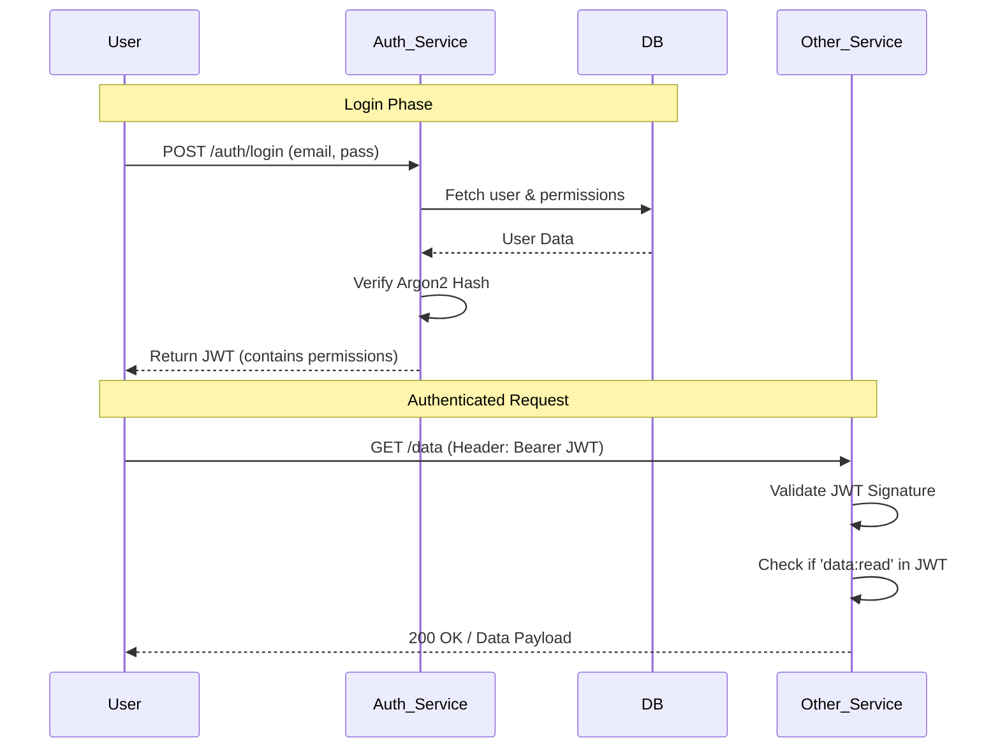
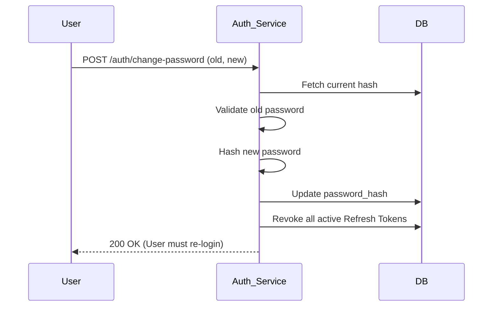

# Service Workflows

## Authentication & Authorization Flow

This diagram shows how a user logs in and how subsequent requests are validated.

## Password Change Workflow

This ensures that security is maintained even if a session is hijacked.

