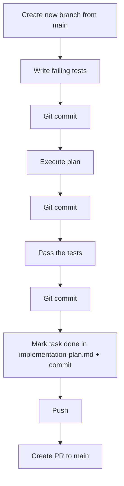
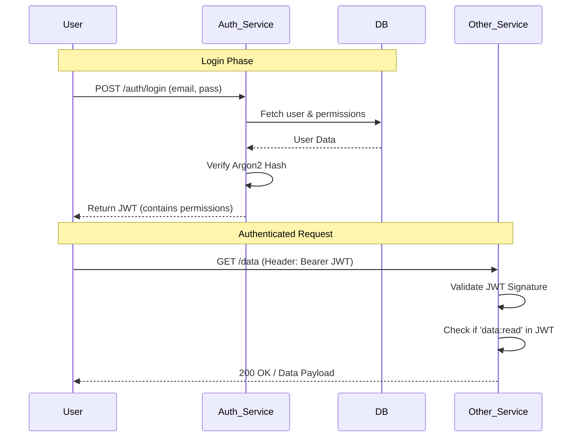
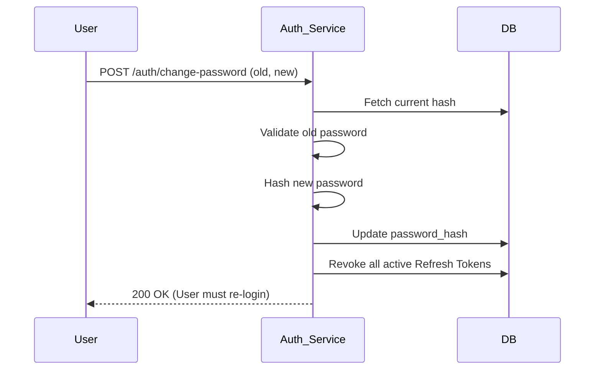

# IAM Microservice (user-microservice-js)

## Project Overview

Identity and Access Management (IAM) microservice with authentication and RBAC-based user management.

## Tech Stack

- **Runtime:** TypeScript on Node.js
- **Framework:** Express.js
- **Database:** PostgreSQL with Drizzle-ORM
- **Auth:** JWT (access + refresh tokens) with Argon2id password hashing
- **Validation:** Zod
- **API Style:** REST

## Architecture

Layered architecture: routes -> middleware -> services -> db

```
src/
├── config/env.ts          # Typed env config (dotenv)
├── db/schema/             # Drizzle table definitions (7 RBAC tables)
├── db/relations.ts        # Drizzle relations
├── db/index.ts            # DB client
├── db/migrate.ts          # Migration runner
├── db/seed.ts             # Seed roles + permissions
├── middleware/             # authenticate, authorize, validate, error-handler
├── routes/                # auth.routes.ts, users.routes.ts
├── services/              # auth.service.ts, users.service.ts
├── utils/                 # password, jwt, errors, response, async-handler
├── validators/            # Zod schemas for auth + users
├── types/                 # Shared types, Express augmentation
├── app.ts                 # Express app setup
└── server.ts              # Entry point
```

## Database Schema (RBAC)

7 tables: `users`, `profiles`, `roles`, `permissions`, `role_permissions`, `user_roles`, `refresh_tokens`

- Permission-based access control (not role-based checks)
- JWT contains flattened array of permission slugs
- Refresh token rotation (single-use)
- Password change revokes all refresh tokens (kill-switch)

## Key Commands

```bash
npm run dev              # Start dev server (tsx watch)
npm run build            # Compile TypeScript
npm run start            # Run compiled JS
npm run db:generate      # Generate Drizzle migrations
npm run db:migrate       # Apply migrations
npm run db:seed          # Seed roles + permissions
```

## API Endpoints

### Auth (`/auth`)
- `POST /auth/register` — Public registration (assigns default role)
- `POST /auth/login` — Returns access + refresh tokens
- `POST /auth/refresh` — Rotate refresh token, issue new pair
- `POST /auth/change-password` — Requires old password, revokes all sessions
- `POST /auth/reset-password` — Token-based reset

### Users (`/users`)
- `POST /users` — Admin-only user creation with role assignment
- `GET /users` — List/filter users (admin only, paginated)
- `PATCH /users/:id` — Update profile or deactivate
- `PUT /users/:id/roles` — Reassign roles

## Implementation Patterns

- Transactions for multi-table mutations (register, role updates)
- `asyncHandler` wrapper for Express route error propagation
- Custom `AppError` subclasses (ConflictError, UnauthorizedError, ForbiddenError, NotFoundError)
- `onConflictDoNothing()` for idempotent seeding
- Reusable `getUserPermissions(userId)` for login + refresh flows

## **IMPORTANT**: Git ethics — MUST follow strictly

- Do `git add` and `git commit` after every meaningful change (e.g., after writing tests, after implementing code, after fixing tests). Do NOT batch all work into a single commit at the end.
- Don't push directly to main
- **CRITICAL**: Always create a NEW branch for EACH task (e.g., `feat/task-1.4-seed-script`). Never add commits for a new task onto an existing task's branch. Create the branch from `main` before starting any work.
- Once task is completed, push the branch and create a PR to main
- Commit messages should be descriptive and follow conventional commit style

## Package / library ethics

- You must not pull or download packages that we don't need yet

## **IMPORTANT**: Plan execution / build workflow — MUST follow strictly

Every task MUST follow this exact workflow in order. Do NOT skip steps.

1. **Create a NEW branch from `main`** — e.g., `feat/task-X.Y-description`. Never reuse another task's branch.
2. **Write failing tests FIRST** — before writing any implementation code
3. **Git commit** the failing tests
4. **Implement the code** to make the tests pass
5. **Git commit** the implementation
6. **Run the tests** and ensure they pass
7. **Git commit** any fixes needed to pass tests
8. **Mark the task `[x]`** in `specs/v1/implementation-plan.md` and commit
9. **Push** the branch to remote
10. **Create a PR** to main



**Violations**: Skipping the test-first step, reusing another task's branch, writing all code without intermediate commits, skipping the task status update, or pushing directly to main are NOT acceptable.

## Service Workflows

### Authentication & Authorization Flow

This diagram shows how a user logs in and how subsequent requests are validated.



### Password Change Workflow

This ensures that security is maintained even if a session is hijacked.



## **IMPORTANT**: CLAUDE.md management
- Always update CLAUDE.md with important architectural changes
- Always use mermaid.js syntax for workflows

## **IMPORTANT**: Do not load to context unless explicitly mentioned
./specs/*