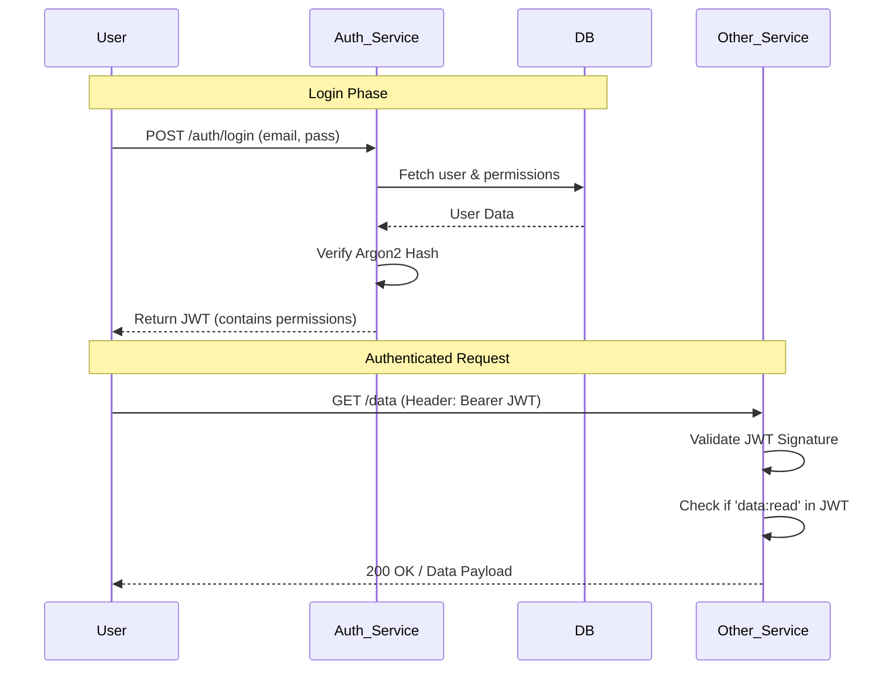
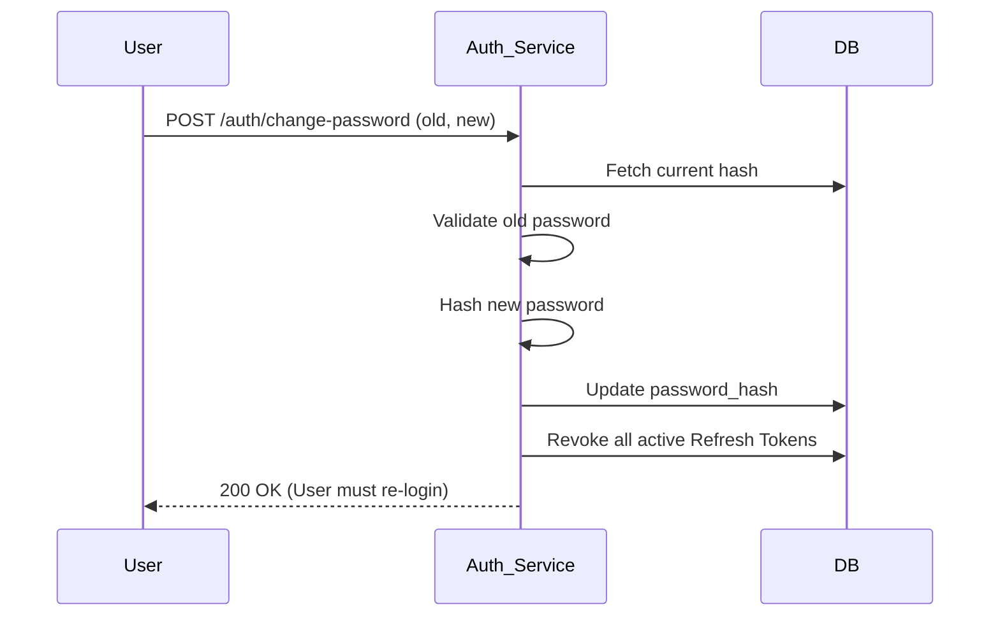

# Design 

This summary outlines the plan for a high-performance **Identity and Access Management (IAM)** 
microservice, designed to handle both authentication and user management within a single database.

---

## 1. Architecture & Tech Stack

The service is designed for high concurrency, strict security, and seamless frontend integration.

- **Language:** **TypeScript (Node.js)** — Chosen for its non-blocking I/O (perfect for auth latency), strict type safety, and the ability to share type definitions with the frontend.
- **Database:** **PostgreSQL** — Handles the relational complexity of Role-Based Access Control (RBAC) with ease.
- **Cryptography:** **Argon2id** for hashing passwords and **JWT (JSON Web Tokens)** for stateless, scalable authentication.
- **Communication:** **REST API** (standard for service-to-service communication).
- **ORM: Drizzle-ORM** for connecting and communicating with database

---

## 2. Database Schema (RBAC)

The schema follows a granular Permission-based model to ensure maximum flexibility.

|**Table**|**Key Columns**|**Description**|
|---|---|---|
|**users**|`id`, `email`, `password_hash`, `is_active`|Core credentials.|
|**profiles**|`user_id`, `first_name`, `avatar_url`|Non-sensitive metadata.|
|**roles**|`id`, `name`, `slug`|User categories (e.g., `admin`).|
|**permissions**|`id`, `slug`|Granular actions (e.g., `user:write`).|
|**role_permissions**|`role_id`, `permission_id`|Links actions to roles.|
|**user_roles**|`user_id`, `role_id`|Assigns roles to users.|
|**refresh_tokens**|`id`, `user_id`, `token`, `expires_at`|Manages persistent sessions.|

---

## 3. API Endpoints

### Authentication (`/auth`)

- `POST /auth/register`: Public self-registration (assigns default role).
- `POST /auth/login`: Credential validation; returns Access & Refresh tokens.
- `POST /auth/change-password`: Authenticated password update (requires old password).
- `POST /auth/reset-password`: Token-based reset for forgotten passwords.

### User Management (`/users`)

- `POST /users`: Admin-only user creation (allows role assignment).
- `GET /users`: List and filter users (Admin only).
- `PATCH /users/:id`: Update profiles or deactivate accounts.
- `PUT /users/:id/roles`: Update user permission levels.

---

## 4. Workflows

### Authentication & Authorization Flow

This diagram shows how a user logs in and how subsequent requests are validated.

### Password Change Workflow

This ensures that security is maintained even if a session is hijacked.

---

## 5. Access Checking Strategy

Instead of checking for a "Role" (e.g., `if (user.role == 'admin')`), the system checks for a **Permission**.

- **Logic:** Roles are simply containers for permissions.
- **Implementation:** The JWT contains a flattened array of permission slugs (e.g., `["user:create", "post:delete"]`).
- **Middleware:** A simple check determines if the required permission for an endpoint exists within the user's JWT.

# Phase and tasks

## Phase 1: Database Schema & Type Definitions

Since everything depends on the relational RBAC model, this phase establishes the data "source of truth" and TypeScript interfaces.

- **Task 1.1: Initialize PostgreSQL Schema**
    - Write SQL migrations or use an ORM to create the `users`, `profiles`, `roles`, `permissions`, `role_permissions`, `user_roles`, and `refresh_tokens` tables.
- **Task 1.2: Define TypeScript Interfaces**
    - Create shared types for `User`, `Role`, and `Permission` to ensure type safety across the service and future frontend integration.
- **Task 1.3: Seeding Basic Roles**
    - Write a script to seed the database with initial permissions (e.g., `user:write`, `user:read`) and at least one `admin` role.

---

## Phase 2: Identity & Authentication Core

This phase focuses on the "Login Phase" logic, using `.env` for immediate local development.

- **Task 2.1: Argon2id Hashing Utility**
    - Implement a utility module using `argon2` for hashing and verifying passwords.
- **Task 2.2: Register & Login Logic (`/auth`)**
    - Code `POST /auth/register` to handle user creation and default role assignment.
    - Code `POST /auth/login` to verify credentials and issue the initial JWT.
- **Task 2.3: JWT Issuance Strategy**
    - Implement the logic to generate Access and Refresh tokens, ensuring the Access Token contains the flattened array of permission slugs.

---

## Phase 3: Authorization & Middleware

This phase implements the "Access Checking Strategy" to protect your routes.

- **Task 3.1: JWT Validation Middleware**
    - Create a middleware to intercept REST requests, validate the JWT signature, and attach the user payload to the request object.
- **Task 3.2: Permission-Based Guard**
    - Write a higher-order function or middleware that checks if a specific permission slug (e.g., `user:write`) exists in the user's JWT.
- **Task 3.3: Persistent Session Management**
    - Code the logic to store `refresh_tokens` in PostgreSQL and implement a "refresh" endpoint to rotate tokens.

---

## Phase 4: Account Lifecycle & Admin Routes

Building out the workflows for password security and administrative management.

- **Task 4.1: Secure Password Change**
    - Implement `POST /auth/change-password` with the "Security Kill-Switch": a database query that deletes all active refresh tokens for that user ID upon success.
- **Task 4.2: Admin User Management (`/users`)**
    - Code the `POST`, `GET`, and `PATCH` routes for the `/users` endpoint, protected by `admin` permissions.
- **Task 4.3: RBAC Modification Logic**
    - Implement `PUT /users/:id/roles` to allow admins to reassign user categories and update their permission levels.

---

## Phase 5: Containerization & Secrets Migration

Now that the code is functional, you move it into a production-ready infrastructure.

- **Task 5.1: Docker Compose Orchestration**
    - Create a `docker-compose.yml` to link the Node.js service with the PostgreSQL database.
- **Task 5.2: HashiCorp Vault Integration**
    - Modify the startup logic to fetch database credentials and JWT secrets from **Vault** via the **Docker Compose** environment, replacing the local `.env` file.
- **Task 5.3: Performance Benchmarking**
    - Conduct load tests on the `/auth/login` route to ensure the non-blocking I/O and Argon2id settings meet your high-performance requirements.