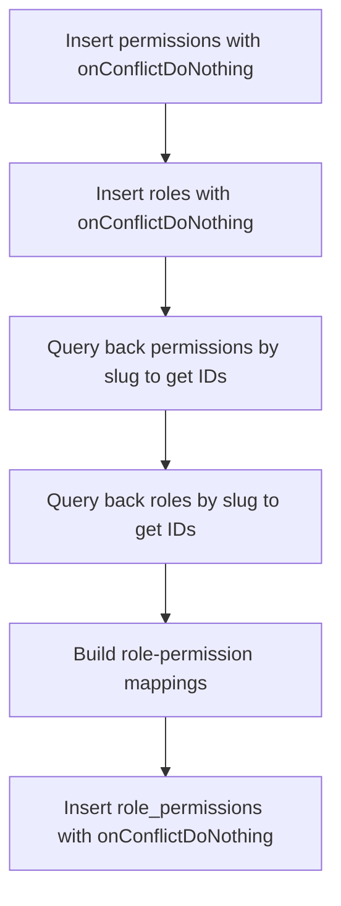

# Task 1.4: Seed Script — Implementation Plan

## Status: DONE

## Context

Task 1.4 creates a seed script (`src/db/seed.ts`) that populates the database with default RBAC roles and permissions. This is required so the application has foundational `admin` and `user` roles with their associated permissions on first deployment.

**Prerequisites (completed):** Tasks 1.1 (schema), 1.2 (types), 1.3 (DB client + migration runner).

---

## Files Created

| File | Purpose |
|------|---------|
| `src/db/seed.ts` | Seed script — inserts default permissions, roles, and role-permission mappings |
| `src/db/__tests__/seed.test.ts` | Unit tests for `seedDatabase()` |

---

## Implementation Details

### Seed Data

**Permissions (5):**
| Slug | Description |
|------|-------------|
| `user:read` | Read user data |
| `user:write` | Create and update users |
| `user:delete` | Delete users |
| `role:read` | Read roles |
| `role:write` | Create and update roles |

**Roles (2):**
| Name | Slug | Permissions |
|------|------|-------------|
| Admin | `admin` | All 5 permissions |
| User | `user` | `user:read` only |

### `seedDatabase()` Flow



### Key Design Decisions

1. **Idempotency via `onConflictDoNothing()`** — Script can be re-run safely without duplicate errors.
2. **Query-back pattern** — After inserting, we query permissions and roles by slug to get their IDs. This is necessary because `onConflictDoNothing()` returns empty arrays when rows already exist, so `.returning()` alone is unreliable for building the join table.
3. **Entry-point pattern** — Follows the same `require.main === module` pattern as `migrate.ts` with `sql.end()` cleanup and error handling.

### Test Coverage (5 tests)

1. Inserts 5 permissions with correct slugs and `onConflictDoNothing()`
2. Inserts 2 roles with correct slugs and `onConflictDoNothing()`
3. Inserts 6 role-permission mappings (admin: 5, user: 1) with `onConflictDoNothing()`
4. Calls insert exactly 3 times in correct order (permissions → roles → role_permissions)
5. Propagates errors from failed inserts

### Testing Approach

- **Framework:** Vitest
- **Mocking:** Drizzle `db.insert().values().onConflictDoNothing()` chain and `db.select().from().where()` chain
- **Pattern:** Follows `migrate.test.ts` conventions — `vi.mock()` for module mocks, dynamic `await import()` for module-under-test, `beforeEach` with `vi.clearAllMocks()`

---

## Verification

```bash
npm test                    # All 31 tests pass (4 test files)
npm run db:seed             # Runs without error (requires running DB)
npm run db:seed && npm run db:seed  # Idempotent — second run succeeds
```
