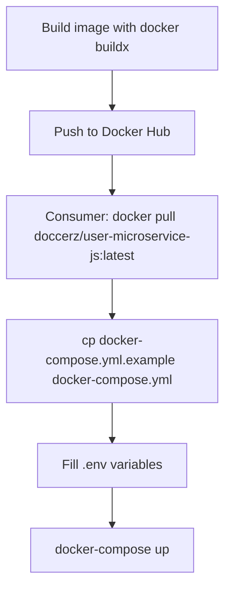

# Docker Registry Plan

## Goal

Publish the app image to Docker Hub so consumers can run the service without cloning the repository or building locally.

## Registry

- **Image:** `doccerz/user-microservice-js:latest`
- **Registry:** Docker Hub (`docker.io`)

## Tasks

- [x] Build and push image to Docker Hub
- [x] Create `docker-compose.yml.example` using registry image
- [x] Update `README.md` with pull and registry-based compose instructions

## Workflow



## Files Changed

| File | Change |
|---|---|
| `docker-compose.yml.example` | New file — compose using registry image, no `build: .` |
| `README.md` | Added Docker Hub pull instructions and registry-based compose workflow |

## docker-compose.yml.example vs docker-compose.yml

| | `docker-compose.yml` | `docker-compose.yml.example` |
|---|---|---|
| App source | `build: .` (local build) | `image: doccerz/user-microservice-js:latest` (registry pull) |
| Use case | Local development / CI | Production / consumers without source |
| Committed | Yes (tracked) | Yes (template only) |

## Usage

```bash
# Pull latest image
docker pull doccerz/user-microservice-js:latest

# Use registry-based compose
cp docker-compose.yml.example docker-compose.yml
# configure .env with required variables (see README)
docker-compose up
```

## Required Environment Variables

| Variable | Description |
|---|---|
| `DATABASE_USER` | Postgres username |
| `DATABASE_PASSWORD` | Postgres password |
| `DATABASE_NAME` | Postgres database name |
| `DATABASE_URL` | Full connection string (e.g. `postgresql://user:pass@db:5432/iam_db`) |
| `DATABASE_SCHEMA` | Drizzle schema name (e.g. `user-service`) |
| `JWT_ACCESS_SECRET` | Access token signing secret |
| `JWT_REFRESH_SECRET` | Refresh token signing secret |
| `JWT_ACCESS_EXPIRY` | Access token TTL (e.g. `15m`) |
| `JWT_REFRESH_EXPIRY` | Refresh token TTL (e.g. `7d`) |
